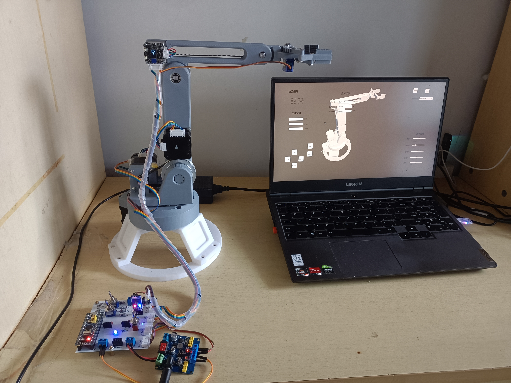

# Four-Axis Robotic Arm (STM32 + Unity + MATLAB)

本项目为四轴机械臂毕业设计开源仓库，包含机械结构设计、运动学建模验证、硬件电路设计以及 STM32 驱动与上位机联动。

## 项目概览

- 机械结构：基于 SolidWorks 建模，完成底座、腰关节、大臂、小臂与夹爪结构设计。
- 运动学：完成正运动学与逆运动学推导，并用 MATLAB 进行验证。
- 硬件设计：包含控制板/电路相关资料与 PCB 源文件。
- 控制系统：下位机使用 STM32（Keil 工程），上位机使用 Unity 3D。

## 效果与资料预览

### 结构图与样机实物

### 系统电路

### 上位机界面

## 仓库结构

| 路径 | 说明 |
|---|---|
| `app/` | Unity 3D 上位机程序（当前仓库为构建产物） |
| `matlab/` | 运动学验证代码（含 D-H 建模与逆解相关脚本） |
| `model/` | 机械臂 3D 模型导出文件（`obj/`、`3ds/`） |
| `assets/` | README 图片、电路图、机械图纸等资料 |
| `Stm32_Project/` | STM32 下位机控制代码（Keil 工程） |

## DH 参数与正逆运动学

机械臂采用标准 D-H 建模，共 5 个连杆（4 个主控关节 + 末端夹爪）。MATLAB 验证代码见 `matlab/dh.m` 与 `matlab/inverse_kinematics.m`。

### D-H 参数表

| 连杆 | $\theta$ | $d$ (mm) | $a$ (mm) | $\alpha$ (°) |
|:---:|:---:|:---:|:---:|:---:|
| 0-1 | $-90°+\theta_1$ | 0 | 29 | -90 |
| 1-2 | $-90°+\theta_2$ | 0 | 150 | 0 |
| 2-3 | $75°+\theta_3$ | 0 | 134.5 | 0 |
| 3-4 | $65°+\theta_4$ | 0 | 0 | 90 |
| 4-5 | $-90°+\theta_5$ | 80 | 0 | 90 |

### 正运动学

将各关节 D-H 变换矩阵依次右乘，得到末端相对基座的总变换矩阵：

$${}^0T_H = A_1 A_2 A_3 A_4 A_5 = \begin{bmatrix} n & o & a & p \end{bmatrix}$$

其中方向向量 $n, o, a$ 描述末端姿态，位置向量 $p = (p_x, p_y, p_z)$ 描述末端在基坐标系中的坐标。

各关节变换矩阵（$C_i = \cos\theta_i,\ S_i = \sin\theta_i$）：

$$A_1 = \begin{bmatrix} C_1 & 0 & -S_1 & a_1 C_1 \\ S_1 & 0 & C_1 & a_1 S_1 \\ 0 & -1 & 0 & 0 \\ 0 & 0 & 0 & 1 \end{bmatrix}, \quad A_2 = \begin{bmatrix} C_2 & -S_2 & 0 & a_2 C_2 \\ S_2 & C_2 & 0 & a_2 S_2 \\ 0 & 0 & 1 & 0 \\ 0 & 0 & 0 & 1 \end{bmatrix}$$

$$A_3 = \begin{bmatrix} C_3 & -S_3 & 0 & a_3 C_3 \\ S_3 & C_3 & 0 & a_3 S_3 \\ 0 & 0 & 1 & 0 \\ 0 & 0 & 0 & 1 \end{bmatrix}, \quad A_4 = \begin{bmatrix} C_4 & 0 & S_4 & 0 \\ S_4 & 0 & -C_4 & 0 \\ 0 & 1 & 0 & 0 \\ 0 & 0 & 0 & 1 \end{bmatrix}, \quad A_5 = \begin{bmatrix} C_5 & 0 & S_5 & 0 \\ S_5 & 0 & -C_5 & 0 \\ 0 & 1 & 0 & d_5 \\ 0 & 0 & 0 & 1 \end{bmatrix}$$

总变换矩阵展开式（其中 $C_{ij} = \cos(\theta_i+\theta_j)$，以此类推）：

$${}^0T_H = \begin{bmatrix} C_{234}C_1C_5 - S_1S_5 & S_{234}C_1 & C_1 C_{234}S_5 + S_1C_5 & C_1(a_1 + d_5 S_{234} + a_3 C_{23} + a_2 C_2) \\ C_1S_5 + S_{234}S_1C_5 & S_{234}S_1 & S_1 C_{234}S_5 - C_1C_5 & S_1(a_1 + d_5 S_{234} + a_3 C_{23} + a_2 C_2) \\ -S_{234}C_5 & C_{234} & -S_{234}S_5 & d_5 C_{234} + a_3 S_{23} - a_2 S_2 \\ 0 & 0 & 0 & 1 \end{bmatrix}$$

### 逆运动学
为了方便表示，将上面的矩阵表示为*RHS* (Right-Hand Side)。将机械臂末端的期望位姿表示为：

$$
\ ^RT_H = \begin{bmatrix}
n_x & o_x & a_x & p_x \\
n_y & o_y & a_y & p_y \\
n_z & o_z & a_z & p_z \\
0 & 0 & 0 & 1
\end{bmatrix} \tag{2-15}
$$
根据期望末端位姿 ${}^RT_H$，采用代数解耦法，依次反解各关节角，求解顺序如下：

**① 求 $\theta_5$**：由总变换矩阵 $(3,2)$ 元素对应关系得

$$\theta_5 = \arctan\!\left(\frac{a_z}{n_z}\right)$$

**② 求 $\theta_1$**：由 $(1,4)$、$(2,4)$ 元素得

$$\theta_1 = \arctan\!\left(\frac{p_y - d_5 o_y}{p_x - d_5 o_x}\right)$$

**③ 求 $\theta_3$**：利用 $\theta_1$ 已知，由 $(2,4)$、$(3,4)$ 建立方程后两边平方相加，利用 $S_2 S_{23} + C_2 C_{23} = C_3$ 化简得

$$C_3 = \frac{\left(d_5 o_z - p_z\right)^2 + \left(\dfrac{p_y - d_5 o_y}{S_1} - a_1\right)^2 - a_2^2 - a_3^2}{2 a_2 a_3}, \quad \theta_3 = \arctan\!\left(\frac{\pm\sqrt{1-C_3^2}}{C_3}\right)$$

**④ 求 $\theta_2$**：令 $\tan\phi = \dfrac{a_3 S_3}{a_3 C_3 + a_2}$，则

$$\theta_2 = \arcsin\!\left(\frac{d_5 o_z - p_z}{\sqrt{a_2^2 + a_3^2 + 2 a_2 a_3 C_3}}\right) - \phi$$

**⑤ 求 $\theta_4$**：由 $(3,3)$ 元素 $\cos(\theta_2+\theta_3+\theta_4) = o_z$ 得

$$\theta_4 = \arccos(o_z) - \theta_2 - \theta_3$$

## 环境与使用说明

### 1) STM32 下位机

- 工程路径：`Stm32_Project/Project.uvprojx`
- 目标芯片：`STM32F103C8`（Cortex-M3）
- 开发环境：Keil MDK（uVision）
- 使用方式：打开工程、编译后通过 ST-Link 等方式下载到开发板。
- 通过串口与上位机通信

### 2) MATLAB 运动学验证

- 代码路径：`matlab/`
- 主要脚本：`dh.m`、`inverse_kinematics.m`、`dof_5.m`
- 说明：脚本使用机器人运动学工具箱相关能力（如 `SerialLink`），需要配置matlab Robotic Toolbox工具箱。

### 3) Unity 上位机

- 程序路径：`app/`
- 说明：当前仓库目前仅提供上位机构建结果，可直接运行并与下位机联调。

## 开源说明

### License

当前仓库暂未附带 `LICENSE` 文件。正式公开前建议补充开源许可证（如 MIT 或其他适合软硬件项目的许可证）。

### 免责声明

本项目主要用于学习与毕业设计交流。请在实际制作、调试和使用过程中自行评估风险，作者不对由此产生的直接或间接损失负责。

